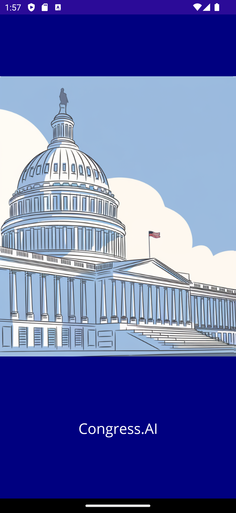
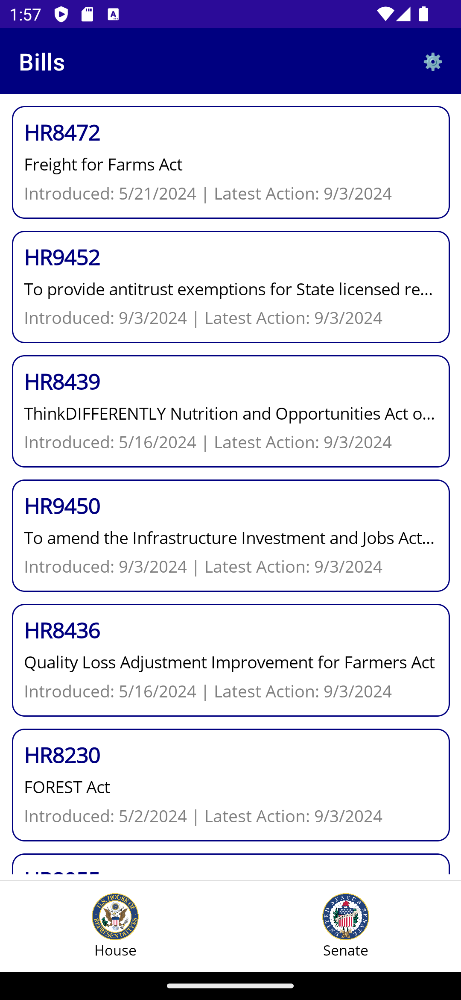
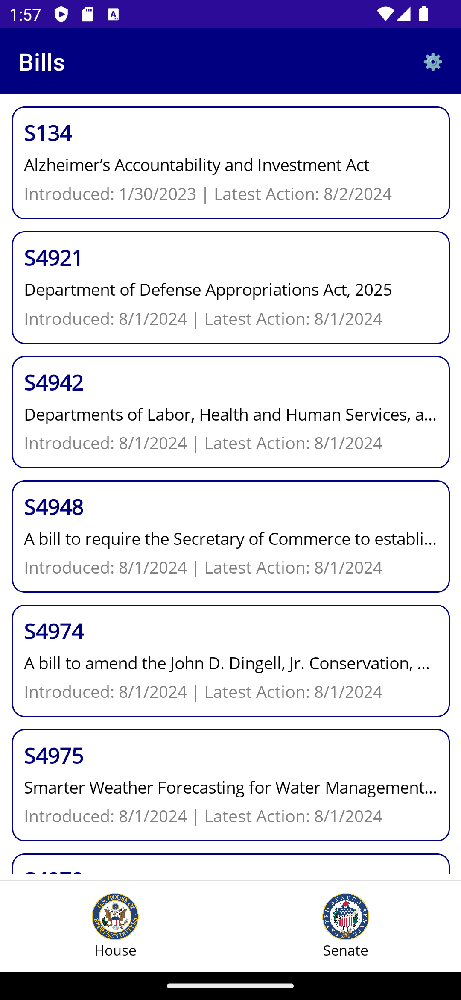
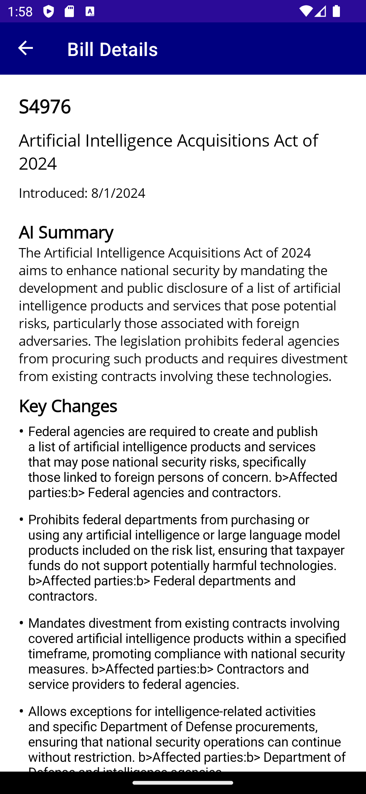
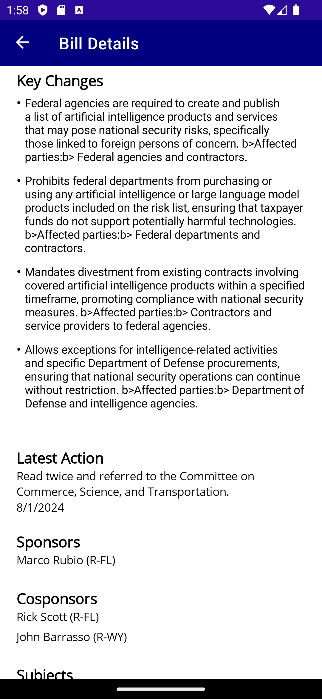
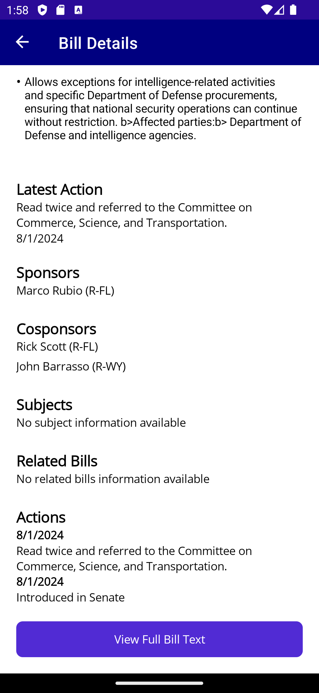
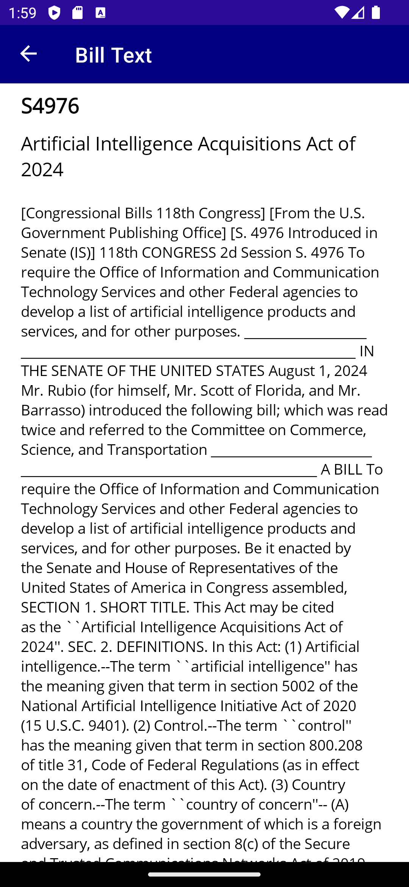
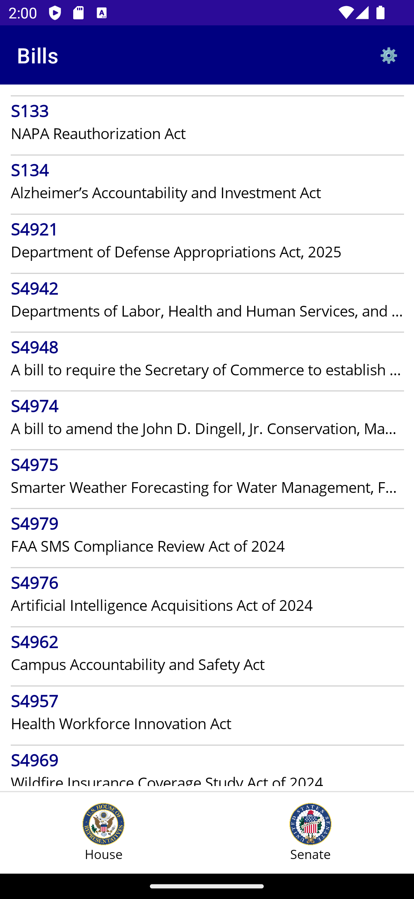
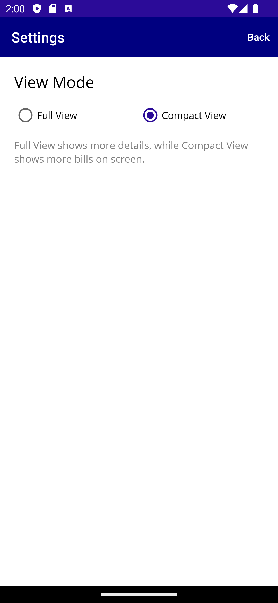

# Congress.Ai


## Overview

Congress.Ai is a cross-platform mobile application designed to provide users with comprehensive information about U.S. Congress bills. The app allows users to browse, search, and view detailed information about various bills, including their sponsors, cosponsors, related actions, summaries, and more. Utilizing AI-generated summaries and key changes, Congress.Ai aims to make legislative information more accessible and understandable.

## Features

- **Bill Listings**: Browse through a list of bills categorized by type (e.g., House, Senate).
  
    
- **Bill Details**: View detailed information about each bill, including sponsors, cosponsors, related bills, actions, and full text.
- **AI-Generated Summaries**: Access AI-generated summaries and key changes for each bill to understand their impact quickly.
  
      
- **Search Functionality**: Search for bills by number, title, or keywords.
- **View Modes**: Toggle between full and compact view modes for better readability.
  
  
- **Settings**: Customize your viewing preferences and app settings.
  
   

## Technologies Used

- **.NET MAUI**: The app is built using .NET Multi-platform App UI (MAUI) to ensure it runs seamlessly on Android, iOS, and other platforms.
- **C#**: The primary programming language used for implementing the application's logic.
- **Azure Cosmos DB**: Utilized as the backend database to store and retrieve bill data efficiently.
- **OpenAI AI Integration**: AI services are integrated to generate summaries and key changes for each bill.
- **MVVM Architecture**: Implements the Model-View-ViewModel (MVVM) pattern to promote a clean separation of concerns and facilitate maintainability.
- **Azure Blob Storage**: Used for storing application state and managing blobs via the BlobStorageManager.
- **OpenAI API**: Leveraged to generate AI-based summaries and key changes for each bill.
- **Newtonsoft.Json**: Employed for JSON serialization and deserialization of data.


### Project Structure

```
App/
├── appsettings.json
├── Models/
│   ├── Bill.cs
│   ├── Cosponsor.cs
│   ├── RelatedBill.cs
│   ├── Summary.cs
│   └── TextVersion.cs
├── Platforms/
│   ├── Android/
│   │   └── MainApplication.cs
│   ├── iOS/
│   │   ├── AppDelegate.cs
│   │   └── Program.cs
│   ├── MacCatalyst/
│   │   ├── AppDelegate.cs
│   │   └── Program.cs
│   ├── Tizen/
│   │   └── Main.cs
│   └── Windows/
│       └── App.xaml.cs
├── Services/
│   ├── CosmosDbService.cs
│   ├── StateService.cs
│   └── OpenAiService.cs
├── ViewModels/
│   ├── BillDetailsPageViewModel.cs
│   ├── BillListPageViewModel.cs
│   ├── MainPageViewModel.cs
│   ├── SettingsViewModel.cs
│   └── BillViewModel.cs
├── Views/
│   ├── MainPage.xaml.cs
│   ├── BillListPage.xaml.cs
│   ├── BillDetailsPage.xaml.cs
│   ├── BillTextPage.xaml.cs
│   └── SettingsPage.xaml.cs
├── AppShell.xaml.cs
├── App.xaml.cs
├── README.md
CongressDataCollector/
CongressDataCollectorPy/
├── main.py
├── config.py
├── api_client.py
├── cosmos_db_client.py
├── models.py
├── daily_bill_fetch.py
├── openai_service.py
└── full_bill_fetch.py
├── CongressDataCollector.Core/
│   └── Models/
│       ├── Bill.cs
│       ├── Cosponsor.cs
│       ├── RelatedBill.cs
│       ├── Summary.cs
│       └── TextVersion.cs
├── CongressDataCollector.Services/
│   ├── CosmosDbService.cs
│   ├── BlobStorageManager.cs
│   └── OpenAiService.cs
└── README.md
```

## Data Flow

1. **Data Collection**
   - Python scripts fetch data from Congress.gov API.
   - Raw data is processed and enriched.
   - Bills and related data stored in Cosmos DB.

2. **AI Processing**
   - Bill text sent to OpenAI for analysis.
   - Summaries and key points generated.
   - Results stored alongside bill data.

3. **Mobile App Data Access**
   - App requests bill data from Cosmos DB.
   - Cached locally for performance.
   - Updates fetched periodically.
   
# Congress.Ai Architecture

## System Overview

Congress.Ai follows a modern, distributed architecture pattern combining mobile, cloud, and AI services:

### Core Components

- **.NET MAUI Mobile App**: Cross-platform frontend providing user interface and interaction.

- **Azure Cloud Backend**: Scalable services handling data storage and processing:
  - **Blob Storage**: Manages application state via `BlobStorageManager`
  - **Cosmos DB**: Handles bill data storage and retrieval
  - **Azure Functions**: Orchestrates data collection and processing

- **Data Collection Services**:
  - **BillService**: Manages bill data fetching and processing
  - **StateService**: Handles application state persistence
  - **CosmosDbService**: Interfaces with Cosmos DB for data operations
  - **OpenAiService**: Integrates with OpenAI for bill analysis

- **Core Models**:
  - **Bill**: Central data model with comprehensive bill information
  - **Legislative Models**: `LegislativeAction`, `LegislativeSubject`, etc.
  - **Response Models**: Structured API response handlers
  - **Support Models**: `Format`, `Committee`, `PolicyArea`, etc.

- **Python Data Collection**: Automated scripts for gathering and processing congressional data.

- **OpenAI Integration**: AI-powered bill analysis and summary generation.


## Performance Considerations

- **Lazy Loading**: Bill details fetched on demand.
- **Caching**: Local storage of frequently accessed data.
- **Async Operations**: Non-blocking UI during data operations.
- **Batch Processing**: Efficient handling of large datasets.

## Security Implementation

- **Azure Key Vault**: Secure storage of API keys and secrets.
- **HTTPS**: Encrypted data transmission.
- **Azure AD**: Authentication for backend services.
- **Role-Based Access**: Controlled access to sensitive operations.

## Getting Started

### Prerequisites

- **.NET SDK**: Ensure you have the latest version of the .NET SDK installed.
- **Visual Studio**: Recommended for development, with the MAUI workload installed.
- **Azure Resources**:
  - **Cosmos DB Account**: Required for bill data storage
  - **Blob Storage Account**: Required for state management
  - **Azure Functions**: Required for automated data collection
- **API Keys**:
  - **Congress.gov API Key**: For accessing congressional data
  - **OpenAI API Key**: For AI-powered bill analysis

### Installation

1. **Clone the Repository**

   ```bash
   git clone https://github.com/yourusername/Congress.Ai.git
   cd Congress.Ai
   ```

2. **Configure Azure Services**

   - Create a `local.settings.json` file in the CongressDataCollector project:

     ```json
     {
       "IsEncrypted": false,
       "Values": {
         "AzureWebJobsStorage": "UseDevelopmentStorage=true",
         "FUNCTIONS_WORKER_RUNTIME": "dotnet",
         "BlobContainerName": "fetchstate",
         "CosmosEndpoint": "your-cosmos-endpoint",
         "CosmosKey": "your-cosmos-key",
         "CosmosDatabaseId": "your-database-id",
         "CosmosContainerId": "your-container-id",
         "CongressAPIKEY": "your-congress-api-key",
         "OpenAiKey": "your-openai-api-key"
       }
     }
     ```

   - Create an `appsettings.json` file in the App project:

     ```json
     {
       "CosmosEndpoint": "your-cosmos-db-endpoint",
       "CosmosKey": "your-cosmos-db-key",
       "CosmosDatabaseId": "YourDatabaseId",
       "CosmosContainerId": "YourContainerId"
     }
     ```

3. **Restore Dependencies**

   ```bash
   dotnet restore
   ```

4. **Run the Application**

   ```bash
   dotnet build
   dotnet run
   ```

## Usage

- **Browse Bills**: Launch the app to view a list of current bills. Use the navigation menu to switch between House and Senate bills.
- **View Bill Details**: Tap on a bill to see detailed information, including sponsors, cosponsors, related bills, and AI-generated summaries.
- **Search Bills**: Use the search feature to find bills by number, title, or keywords.
- **Customize View**: Go to settings to toggle between full and compact view modes.

## Contribution

Contributions are welcome! Please fork the repository and submit a pull request.

## License

This project is licensed under the MIT License.

## Acknowledgements

- Thanks to the .NET MAUI community for their support and resources.
- AI services integrated for generating bill summaries.
